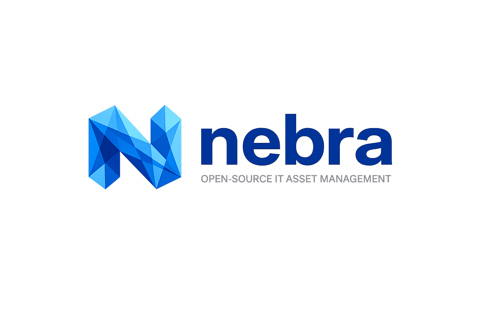

# 

Nebra est une plateforme moderne et puissante de gestion d'inventaire informatique (ITAM) et de CMDB conçue pour les entreprises.
 Elle permet de suivre le cycle de vie complet de vos équipements, de l'achat à la mise au rebut, tout en intégrant des données techniques en temps réel via un agent intelligent.


---

## ✨ Fonctionnalités Clés

### 📦 Gestion de Stock & Inventaire
- **Cycle de Vie Complet** : Suivez vos assets à travers différents états : `EN STOCK`, `DÉPLOYÉ`, `MAINTENANCE`, `ARCHIVÉ`.
- **Check-in / Check-out** : Attribuez du matériel à vos collaborateurs en un clic et suivez les mouvements de stock.
- **Audit Trail** : Historique complet et indélébile de chaque mouvement ou modification sur un équipement.

### 🤖 Agent Intelligent (Nebra Agent)
- **Auto-découverte** : Collecte automatique des informations hardware (CPU, RAM, Disques, Réseau).
- **Heartbeat** : Monitoring en temps réel de l'état "Online/Offline" des machines.
- **Preuve de Vie** : Alerte si un asset marqué "En Stock" est détecté comme actif sur le réseau.

### 🔐 Sécurité Enterprise
- **Rôles Granulaires** :
    - **Admin** : Contrôle total sur l'inventaire, les utilisateurs et la configuration.
    - **Technicien** : Gestion opérationnelle (Ajout, Check-in/out, Maintenance).
- **Authentification Sécurisée** : JWT pour les utilisateurs et clés d'API dédiées pour les agents.

---

## 🛠️ Stack Technique

- **Backend** : FastAPI (Python 3.11), SQLAlchemy 2.0, PostgreSQL 18 / CockroachDB.
- **Frontend** : React 19, TailwindCSS, shadcn/ui, TanStack Query.
- **Agent** : Python 3.11+, psutil.
- **Infrastructure** : Docker, Docker Compose.

---

## 🚀 Démarrage Rapide

La manière la plus simple de lancer Nebra est d'utiliser Docker Compose.

### Pré-requis
- Docker et Docker Compose installés.

### Installation
1. Clonez le dépôt :
   ```bash
   git clone https://github.com/votre-repo/nebra.git
   cd nebra
   ```

2. Lancez la stack complète :
   ```bash
   docker-compose up --build
   ```

3. Accédez aux interfaces :
   - **Frontend** : `http://localhost:5173`
   - **API Documentation (Swagger)** : `http://localhost:8000/docs`

---

## 🗺️ Roadmap

- [ ] **Phase 1** : Gestion de stock de base et Check-in/out (Actuel).
- [ ] **Phase 2** : Système d'alertes en temps réel via WebSockets.
- [ ] **Phase 3** : Import/Export CSV avancé et synchronisation AD/Entra ID.
- [ ] **Phase 4** : Application mobile pour scan de QR Codes et inventaire physique.

---

## 🤝 Contribution

Les contributions sont les bienvenues ! N'hésitez pas à ouvrir une Issue ou une Pull Request pour améliorer Nebra.

---

## 📄 Licence

Distribué sous la licence MIT. Voir `LICENSE` pour plus d'informations.
